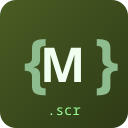

# Morpheus Script

<p align="center">
  
</p>

Full-featured Language Server Protocol implementation for MOHAA Morpheus Script (.scr files), with integrated debugging support for OpenMOHAA.


## Features

### Language Server
- **Completions**: 1,279 built-in functions + 94 Reborn/NightFall community functions
- **Hover Documentation**: Function syntax, descriptions, and examples
- **Signature Help**: Parameter hints as you type
- **Inlay Hints**: See parameter names inline
- **Go to Definition**: Thread, label, and variable navigation (including cross-file)
- **Find All References**: Variable and thread usage tracking across the workspace
- **Rename**: Safe symbol renaming for variables, threads, and labels
- **Document Symbols**: Thread and label outline
- **Workspace Symbols**: Search symbols across all files
- **Call Hierarchy**: View incoming/outgoing call relationships
- **Semantic Highlighting**: Rich syntax coloring distinguishing parameters, local variables, properties, and functions
- **Code Actions**: Quick fixes for common issues (e.g., correcting `==` assignments, replacing deprecated functions)
- **Code Lens**: See reference counts for functions
- **Diagnostics**: Tree-sitter syntax validation + semantic checks
- **Formatting**: AST-aware code formatting
- **Document Links**: Clickable file references in exec/local commands


### Debugging (DAP)
- **Attach to OpenMOHAA**: Connect to running game's debug server
- **Breakpoints**: Set, remove, and manage breakpoints
- **Call Stack**: View execution stack when paused
- **Variables**: Inspect local and level variables
- **Path Translation**: Automatic workspace <-> game path conversion

### External Validation
- **Morfuse Integration**: Validate scripts with the actual game compiler
- **Task Provider**: Auto-detected validation tasks
- **Problem Matcher**: Parse morfuse errors into VS Code problems

### Game Version Support

Filter completions by game version:
- **AA**: Allied Assault (base game)
- **SH**: Spearhead expansion
- **BT**: Breakthrough expansion
- **OPM**: OpenMOHAA community remake
- **Reborn**: Reborn community patch
- **NightFall**: NightFall community patch

## Installation

### From VS Code Marketplace

1. Open VS Code
2. Go to Extensions (Ctrl+Shift+X)
3. Search for "Morpheus Script"
4. Click Install

### From VSIX

1. Download the `.vsix` file from [Releases](https://github.com/mohaa-community/mohaa-lsp/releases)
2. In VS Code, go to Extensions > ... > Install from VSIX...
3. Select the downloaded file

### Build from Source

```bash
git clone https://github.com/mohaa-community/mohaa-lsp.git
cd mohaa-lsp
pnpm install
pnpm build
pnpm package
```

## Quick Start

1. Install the extension
2. Open any `.scr` file
3. Start coding with full IntelliSense support!

## Configuration

### VS Code Settings

```json
{
  "morpheus.gameVersion": ["AA", "SH", "BT"],
  "morpheus.validation.mfusePath": "/path/to/mfuse_exec",
  "morpheus.validation.trigger": "onSave",
  "morpheus.formatting.enable": true,
  "morpheus.trace.server": "off"
}
```

### Debugging

Only supported in DAP Enabled OPM builds.
Create a `.vscode/launch.json`:

```json
{
  "version": "0.2.0",
  "configurations": [
    {
      "type": "openmohaa",
      "request": "attach",
      "name": "Attach to OpenMOHAA",
      "port": 4711,
      "host": "localhost"
    }
  ]
}
```

Then:
1. Start OpenMOHAA with debug mode enabled
2. Press F5 in VS Code to attach
3. Set breakpoints in your .scr files
4. Run the script in-game - execution will pause at breakpoints

### Morfuse Validation Tasks

The extension auto-detects morfuse tasks when `morpheus.validation.mfusePath` is configured. Run with:

- `Ctrl+Shift+B` > Select "Morfuse: Validate Project"
- Or: Terminal > Run Task > morfuse

## Keyboard Shortcuts

| Action | Windows/Linux | macOS |
|--------|--------------|-------|
| Go to Definition | F12 or Ctrl+Click | F12 or Cmd+Click |
| Peek Definition | Alt+F12 | Option+F12 |
| Find All References | Shift+F12 | Shift+F12 |
| Go to Symbol in File | Ctrl+Shift+O | Cmd+Shift+O |
| Go to Symbol in Workspace | Ctrl+T | Cmd+T |
| Rename Symbol | F2 | F2 |
| Trigger Suggestions | Ctrl+Space | Ctrl+Space |
| Show Hover | Ctrl+K Ctrl+I | Cmd+K Cmd+I |

## Development

### Prerequisites

- Node.js 18+
- pnpm
- Emscripten (optional, for rebuilding WASM)

### Setup

```bash
pnpm install
pnpm build
pnpm test
```

### Project Structure

```
mohaa-lsp/
+-- packages/
|   +-- tree-sitter-morpheus/   # Grammar
|   +-- morpheus-lsp/           # Server
|   +-- vscode-morpheus/        # VS Code
+-- editors/
|   +-- neovim/                 # Neovim config
|   +-- claude-code/            # Claude Code config
+-- scripts/
    +-- build.sh                # Build automation
    +-- verify-scr.sh           # Parser verification
```

## Credits

- Tree-sitter grammar and initial LSP by [Feho](https://github.com/Feho/mohaa-lsp)
- DAP debugger and morfuse integration from [morpheus-vscode](https://github.com/elgansayer/morpheus-script-vscode-extension)
- Function documentation sourced from [SublimeMOHAA](https://github.com/eduzappa18/SublimeMOHAA)
- OpenMOHAA community for testing and feedback

## License

[MIT](LICENSE)
